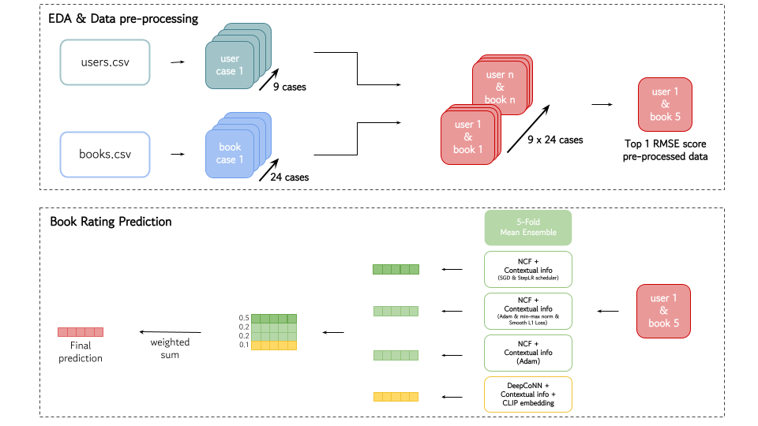

# Book Rating Prediction

   

7th place solution to Book rating prediction challenge in Boostcamp AI Tech 4

[[PDF]](https://drive.google.com/file/d/1Ev7NdhV69SxYzvZEfHJWnhfH-Th4HSon/view?usp=sharing) 


일반적으로 책 한 권은 원고지 기준 800~1000매 정도 되는 분량을 가지고 있다.
뉴스기사나 짧은 러닝 타임의 동영상처럼 간결하게 즐길 수 있는 '숏폼 컨텐츠'는 소비자들이 부담 없이 쉽게 선택할 수 있지만, 책 한 권을 모두 읽기 위해서는 보다 긴 물리적인 시간이 필요하다.
또한 소비자 입장에서는 제목, 저자, 표지, 카테고리 등 한정된 정보로 각자가 콘텐츠를 유추하고 구매 유무를 결정해야 하기 때문에 상대적으로 더욱 신중을 가하게 된다.

책과 관련된 정보와 소비자의 정보, 그리고 소비자가 실제로 부여한 평점, 총 세 가지의 데이터셋(`users.csv`, `books.csv`, `train_ratings.csv`)을 
활용하여 각 사용자가 주어진 책에 대해 어떤 평점을 부여할 지에 대해 예측하는 Challenge를 진행한다.

Team members:
**양성훈, 송영근, 유환승, 전병웅, 노태엽**

## ✔️ Dataset

학습 데이터는 306,795건의 평점 데이터(`train_rating.csv`)이며, 
149,570건의 책 정보(`books.csv`) 및 
68,092명의 고객 정보(`users.csv`)를 이용했다.

각각 데이터는 다음의 형태를 띄고 있다.

- input

  - `train_ratings.csv` : 각 사용자가 책에 대해 평점을 매긴 내역

  - `users.csv` : 사용자에 대한 정보

  - `books.csv` : 책에 대한 정보

  - `Image/` : 책 이미지

평가 데이터는 총 76,699건의 평점 데이터로 구성돼 있다.

- output
  - `test_ratings.csv`의 사용자가 주어진 책에 대해 매길 것이라고 예상하는 평점


## 🎯 Workflow
<p align="center">

<br><br>

본 Challenge는 크게 EDA & data pre-processing 과정과 book rating prediction 과정 두 개로 나뉜다. 특히 EDA를 우선으로 진행하여, 모델 학습에 적용할 수 있는 경우의 수를 모두 고려해 최적의 전처리 데이터를 확보하는 것을 1차 목표로 두었으며 이를 바탕으로 최종적인 book rating prediction task 수행에서 높은 성능을 낼 수 있도록 하였다. 

EDA & data pre-processing를 통해 books와 users 데이터셋 경우의 수 중에서 RMSE가 가장 낮은 데이터셋을 선택한 후, DL Model 중 NCF와 DeepCoNN을 활용하여 최종 예측을 산출해냈다. NCF에는 context information을, DeepCoNN 모델에는 context information, CLIP embedding 정보를 Concatenate 한 커스텀 모델을 제작해 학습을 진행하였다. 가장 성능이 잘 나오는 네 가지 모델을 선정한 뒤, 각 모델을 stratified 5-fold ensemble을 적용하였으며 최종적으로 weighted ensemble하여 평점을 예측하였다.

## 🚩 Get Started

1. Setup

```
  pip install -r requirements.txt
  pip install ftfy regex tqdm
  pip install git+https://github.com/openai/CLIP.git
```

2. Preprocess data

`/opt/ml/data` 폴더에 `books.csv`, `users.csv`, `train_ratings.csv`, `test_ratings.csv` 파일 존재해야 함. 

```
  python preprocess/users.py
  python preprocess/books.py
  python preprocess/clip_embedding.py
  python preprocess/feature2npy.py
```

3. Test EDA number of cases with NCF model
```
  bash experiments/eda_select_top_1.sh | grep rmse: > eda_select_log.txt
```

4. Train & Infer the four workflow models with best eda data pair
```
  python main.py --USER_NUM 1 --BOOK_NUM 6 --MODEL NCF --LOSS sl1 --ZEROONE 1
```

5. Ensemble the four inferences
```
  
```